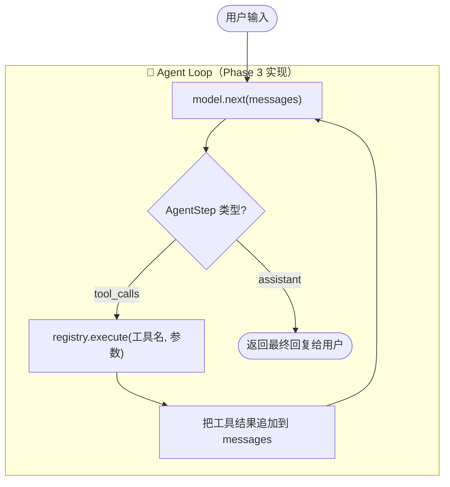
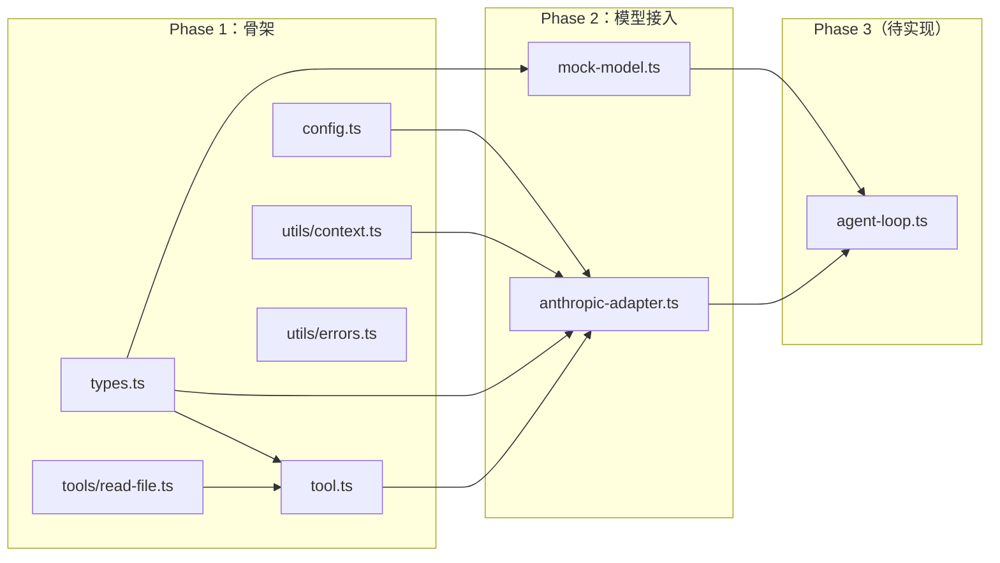
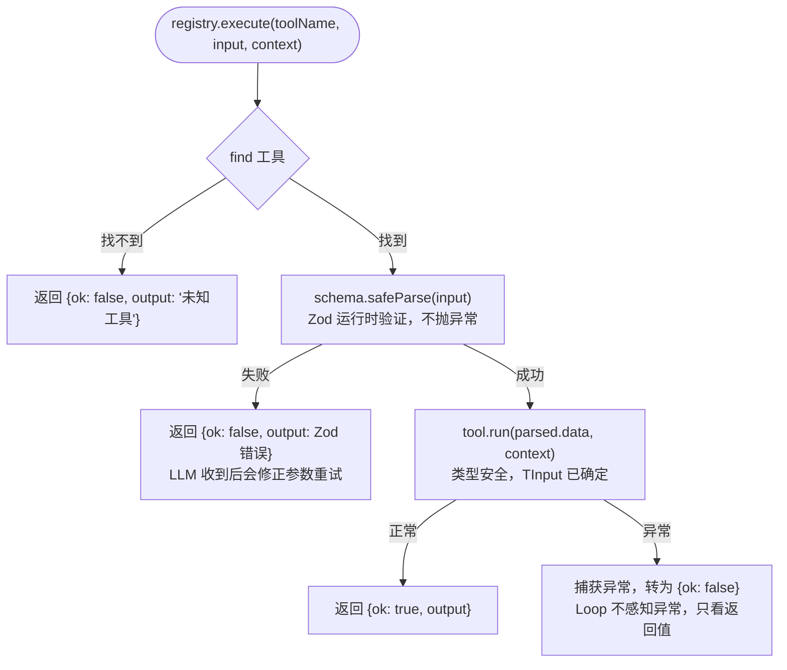
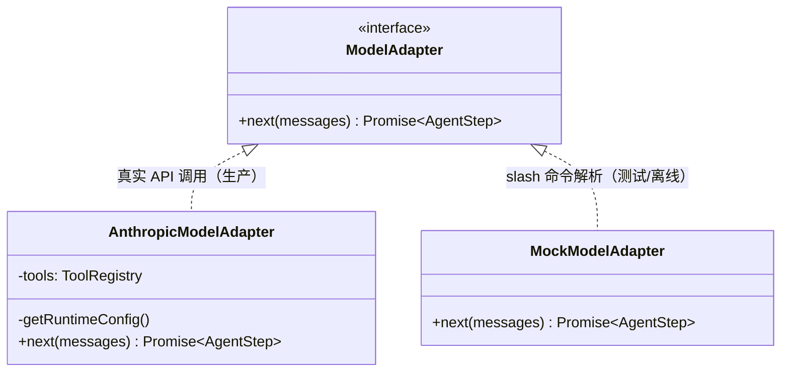
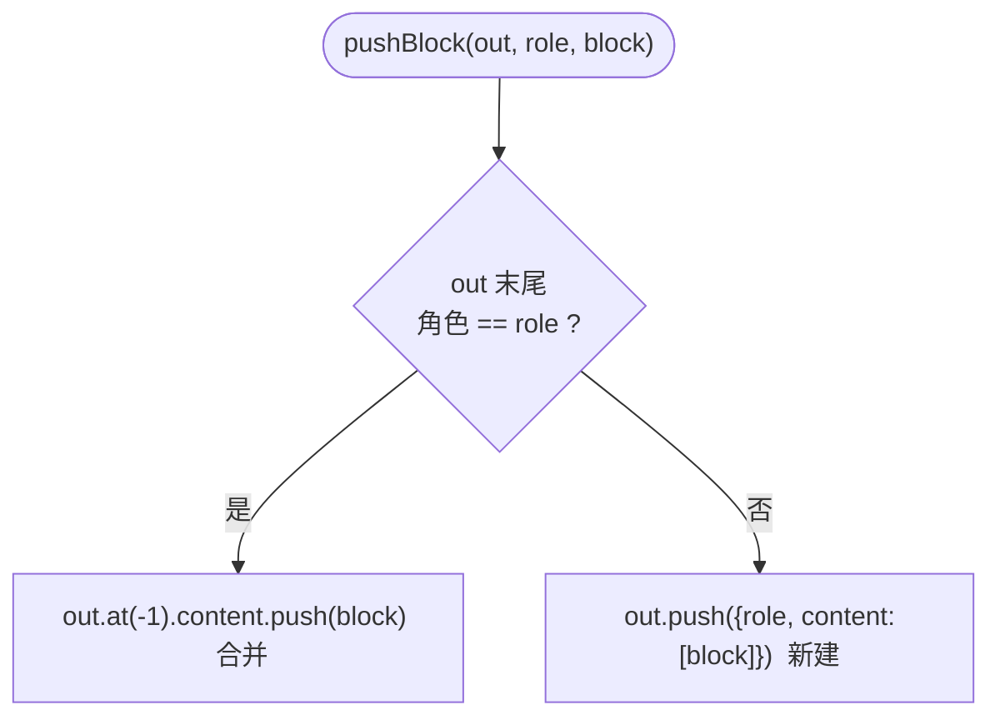
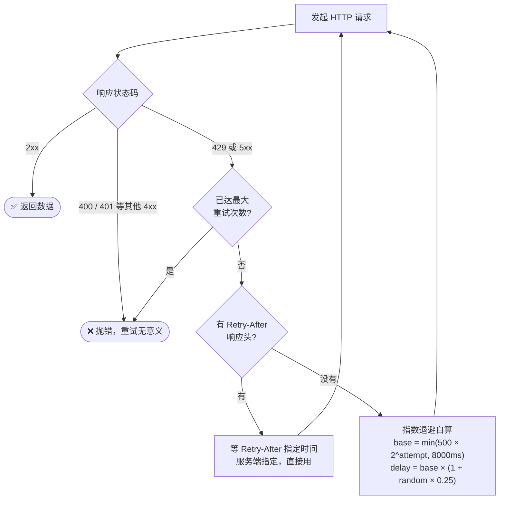
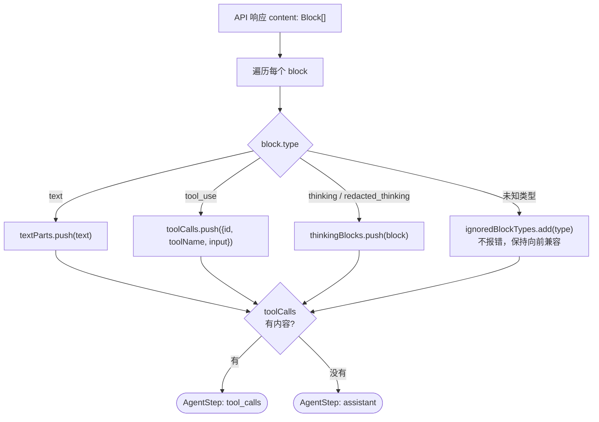
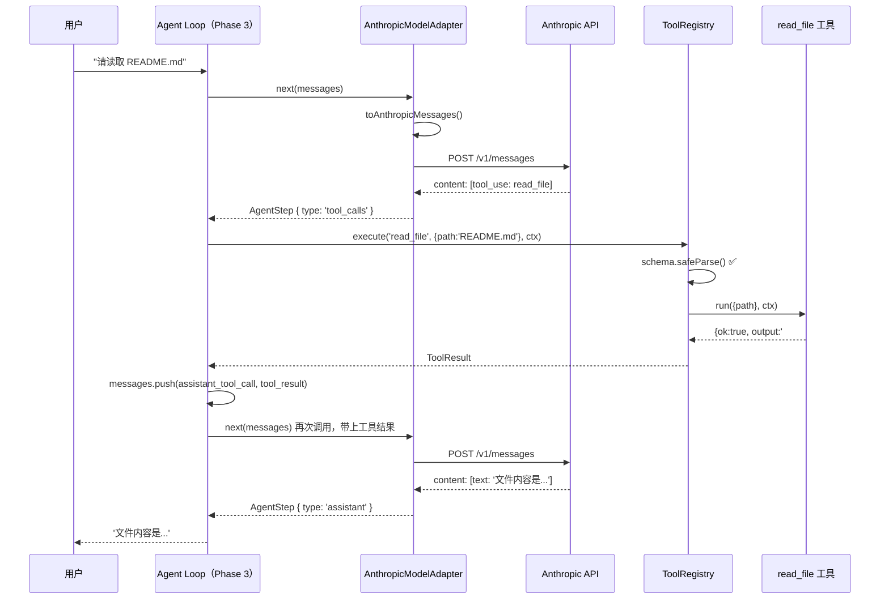

# Phase 1 & 2 代码导读：类型系统 + Anthropic 适配器

> 本文档基于当前已实现的代码，帮助你建立整体架构认知，并理解每个设计决策背后的原因。

---

## 一、项目是什么？

**miniminicode** 是一个从零手写的 AI Coding Agent。整个系统的核心是 **ReAct 循环**：模型推理 → 工具执行 → 模型推理，反复迭代直到任务完成。



循环里有一个关键类型 **`AgentStep`**，是模型每次推理后给 Loop 的"行动指令单"，只有两种可能：

```typescript
type AgentStep =
  | { type: 'tool_calls'; calls: ToolCall[] }  // "我还需要调用这些工具"
  | { type: 'assistant'; content: string }       // "我已经得出答案了"
```

类比：就像你在指挥一个下属完成任务，每次问他"现在怎样了"，他只会给两种回答：
- **"我还需要查资料"**（`tool_calls`）→ 你帮他查，把结果告诉他，继续问
- **"任务完成，结果是 XXX"**（`assistant`）→ 你接收结果，对话结束

名字里的 **Step** 强调这是循环中的一步，不是最终结果——只有 `type: 'assistant'` 时，这一步才是终点。

Phase 1-2 建立了这个循环所需的**所有基础设施**，但还没有循环本身（Phase 3 才有）。

---

## 二、已实现文件全景



---

## 三、Phase 1：类型系统 + 工具注册表

### 3.1 `types.ts` — 整个系统的"数据语言"

#### 核心设计：可辨识联合类型（K-01）

传统写法把所有字段堆在一起，字段全是可选的，不安全：

```typescript
// ❌ 糟糕的写法：role 是宽泛的 string，字段全可选，不知道哪个 role 有哪些字段
type ChatMessage = {
  role: string
  content?: string
  toolUseId?: string
  input?: unknown
  isError?: boolean
}
```

当前的做法：每个 `role` 值对应**唯一的数据形状**：

```typescript
// ✅ 当前写法：role 是字面量类型，分支里字段确定
type ChatMessage =
  | { role: 'user'; content: string }
  | { role: 'assistant_tool_call'; toolUseId: string; toolName: string; input: unknown }
  | { role: 'tool_result'; toolUseId: string; content: string; isError: boolean }
  // ...
```

TypeScript 在 if/switch 分支里自动收窄类型——进入 `role === 'assistant_tool_call'` 分支后，不需要 `as any`，编译器知道 `toolName` 一定存在。

#### `ChatMessage` 的 9 种角色

| role | 语义 | 关键字段 |
|------|------|---------|
| `system` | 系统提示词 | `content` |
| `user` | 用户输入 | `content` |
| `assistant` | 模型最终回复 | `content` + 用量信息 |
| `assistant_progress` | 模型中间进度（Loop 继续） | `content` |
| `assistant_thinking` | Extended Thinking 块 | `blocks` |
| `assistant_tool_call` | 模型要调用工具 | `toolUseId`, `toolName`, `input` |
| `tool_result` | 工具执行结果 | `toolUseId`, `content`, `isError` |
| `context_summary` | 上下文压缩摘要（Phase 5） | `content`, `compressedCount` |
| `snip_boundary` | 历史删除边界标记（Phase 5） | `removedMessageIds` |

#### `AgentStep` — 模型单次推理的返回值

```typescript
type AgentStep =
  | { type: 'tool_calls'; calls: ToolCall[] }  // 模型要调用工具 → Loop 继续
  | { type: 'assistant'; content: string }       // 模型认为完成 → 返回用户
```

这个类型是 Agent Loop 的"路由器"：`tool_calls` 继续循环，`assistant` 退出循环。

---

### 3.2 `tool.ts` — 工具注册表

#### 两套 Schema，各司其职

工具定义里有两个描述参数格式的字段，初看冗余，实则服务于不同阶段、不同读者：

**`inputSchema`（JSON Schema）—— 给 LLM 看的说明书**

调用工具之前，Agent Loop 会把 `inputSchema` 发给 LLM，告诉它"这个工具接受什么参数"：

```json
{
  "type": "object",
  "properties": {
    "path": { "type": "string", "description": "File path relative to cwd" },
    "offset": { "type": "number" },
    "limit":  { "type": "number" }
  },
  "required": ["path"]
}
```

LLM 读懂这份说明书后，生成一个调用请求，比如：`{ "path": "README.md", "limit": 500 }`，通过网络以 JSON 形式传过来。

**问题来了**：这个 JSON 到了 Node.js 里是 `unknown` 类型——TypeScript 的类型系统只存在于编译阶段，运行时根本不知道 LLM 传来的到底是不是合法的 `{ path: string }`，万一模型幻觉传了个 `{ path: 123 }` 怎么办？

**`schema`（Zod）—— 运行时的安全门**

这就是 Zod 的职责：在运行时重新验证一遍：

```typescript
const parsed = tool.schema.safeParse(input)  // input: unknown
if (!parsed.success) {
  return { ok: false, output: parsed.error.message }  // 告诉 LLM 参数有误
}
// parsed.data 类型已确定为 TInput，安全调用
await tool.run(parsed.data, context)
```

两者描述的是**同一套参数规则**，但服务不同时机：

```
编译时：TypeScript 类型  ──► 开发时检查代码正确性
发请求：inputSchema      ──► 告诉 LLM 该传什么
收请求：Zod schema       ──► 验证 LLM 实际传来的是否合法
```

可以把 `inputSchema` 理解成餐厅的菜单（告诉客人能点什么），Zod 是收银台的核验（客人真的点了菜单上的菜才结账）。

#### `ToolRegistry.execute()` 执行流程（K-02, K-03）



---

### 3.3 `config.ts` — 运行时配置（K-04）

```typescript
export async function loadRuntimeConfig(): Promise<RuntimeConfig> {
  const apiKey = (process.env['ANTHROPIC_API_KEY'] ?? '').trim() || undefined
  if (!apiKey && !authToken) throw new Error('No auth configured...')
  // ...
}
```

配置优先级：**环境变量 > 内置默认值**（Phase 5 会在中间插入 settings.json 层）。

函数设计成 `async` 而非模块顶层执行：测试时可以动态 mock 环境变量，每次调用都能拿到新鲜值；Phase 5 需要读文件时，`async` 早已准备好。

---

### 3.4 `tools/read-file.ts` — 分页读取设计

文件可能远超 LLM 单次处理量，通过 `offset + limit` 支持分段读取。每次调用的返回值开头都带一段 header，告诉 LLM 当前读到哪、总共多长、以及下一步怎么做：

```
FILE: big.txt
OFFSET: 0
END: 8000
TOTAL_CHARS: 50000
TRUNCATED: yes - call read_file again with offset 8000

[前 8000 字符的内容...]
```

LLM 看到 `TRUNCATED: yes` 就知道文件没读完，会用 `offset: 8000` 继续调用，直到 `TRUNCATED: no` 为止。这个设计的关键是**把"下一步怎么做"直接写进返回值**，LLM 不需要自己推算，照着 header 的提示走就行。

---

## 四、Phase 2：Anthropic API 适配器

### 4.1 适配器模式架构（K-09）



Agent Loop 只依赖 `ModelAdapter` 接口，切换模型提供商只需换实现，Loop 代码零修改——SOLID 的 D（依赖倒置）原则。

---

### 4.2 `toAnthropicMessages()` — 格式转换（K-06）

内部格式与 Anthropic API 格式有几处关键差异：

| 内部 ChatMessage | → | Anthropic API 格式 |
|----------------|---|-------------------|
| `role: 'system'` | → | 独立的顶层 `system` 字段（不进 messages 数组） |
| `role: 'user'` | → | `{ role:'user', content:[{ type:'text', text }] }` |
| `role: 'assistant_tool_call'` | → | `{ role:'assistant', content:[{ type:'tool_use', id, name, input }] }` |
| `role: 'tool_result'` | → | `{ role:'user', content:[{ type:'tool_result', tool_use_id, content }] }` |
| `role: 'assistant_progress'` | → | 文本包裹为 `<progress>...</progress>` |

`tool_result` 放在 **user 角色**里——Anthropic 的语义：模型（assistant）发起调用，"环境"（user）返回结果。

#### `pushBlock` — 合并相邻同角色消息

Anthropic API 硬性要求：messages 数组里不能出现相邻的同角色消息，否则报 400。



实际场景：模型同时发起两次工具调用，内部产生两条 `assistant_tool_call`，经 `pushBlock` 合并为一条 `assistant` 消息、content 里有两个 `tool_use` 块，满足 API 要求。

---

### 4.3 指数退避重试（K-07）



**为什么加 `random × 0.25` 的随机抖动（Jitter）？**
100 个客户端同时被限流，若没有抖动，大家等待时间完全相同，会在同一时刻同时重试，再次打爆 API。随机抖动让各客户端的重试时间散开，避免"惊群效应"。

---

### 4.4 响应块解析（K-08）

Anthropic API 的 `content` 是混合类型数组，需要分拣：



`ignoredBlockTypes` 的容错设计：Anthropic 未来新增块类型时，这里静默忽略并记录，不会因未知字段而崩溃。

---

### 4.5 `parseMarkers` — 状态标记解析

Agent Loop 需要区分模型回复是"任务完成"还是"中间进度"，通过约定 System Prompt 让模型用标签标注：

| 模型输出 | 解析结果 | Loop 行为 |
|---------|---------|----------|
| `<final>最终答案</final>` | `kind: 'final'` | 返回给用户，退出循环 |
| `<progress>正在处理...</progress>` | `kind: 'progress'` | 不展示给用户，继续推进 |
| 普通文本（无标签） | `kind: undefined` | 由上下文决定 |
| `[FINAL]` / `[PROGRESS]` | 同上（兼容方括号格式） | 同上 |

支持方括号是防御性设计——部分模型不擅长输出尖括号标签（容易漏闭合），方括号格式更稳定。

---

## 五、完整数据流（一次工具调用的全过程）



---

## 六、各文件职责速查

| 文件 | 职责 | 关键知识点 |
|------|------|-----------|
| `types.ts` | 定义所有数据类型 | K-01 可辨识联合 |
| `tool.ts` | 工具注册/执行 | K-02 Zod 验证，K-03 注册表模式 |
| `config.ts` | 加载环境变量配置 | K-04 分层配置 |
| `utils/context.ts` | 计算模型 token 上限 | K-06 |
| `utils/errors.ts` | 提取 Node.js 错误码 | K-08 |
| `tools/read-file.ts` | 读取文件工具 | K-16 fs/promises |
| `mock-model.ts` | 离线 Mock 适配器 | K-09 适配器模式 |
| `anthropic-adapter.ts` | 真实 API 适配器 | K-06 ~ K-09 |

---

## 七、下一步：Phase 3 Agent Loop

Phase 1-2 已完成：

- ✅ 所有数据类型（types.ts）
- ✅ 工具注册和执行框架（tool.ts）
- ✅ 第一个真实工具（read-file.ts）
- ✅ 真实 LLM 适配器（anthropic-adapter.ts）
- ✅ 离线测试适配器（mock-model.ts）

Phase 3 要做的五件事（agent-loop.ts）：

1. **主循环**：`while(true)` 反复调用 `model.next()` 和 `registry.execute()`
2. **消息历史管理**：把每轮的 tool_call 和 tool_result 追加到 messages
3. **终止条件**：`AgentStep.type === 'assistant'` 时退出循环
4. **韧性设计**：空响应、pause_turn 等异常情况的恢复策略
5. **Thinking Block 保留**：Extended Thinking 块需要跨轮次传递，模型才能"接续思考"

---

## 八、常见问题

**Q：为什么 `tool_result` 放在 `user` 角色？**

Anthropic API 的语义设定：模型（assistant）"请求"工具执行，"环境/用户"把查询结果告知模型。符合对话的自然语义，也是 API 的硬性规定。

**Q：`inputSchema`（JSON Schema）和 `schema`（Zod）为什么要写两遍？**

读者不同：JSON Schema 发给 LLM 理解，Zod 给 Node.js 运行时用。未来可用 `zod-to-json-schema` 从 Zod 自动生成 JSON Schema，消除重复（DRY）。

**Q：`parseMarkers` 为什么支持 `<final>` 和 `[FINAL]` 两种格式？**

防御性设计：部分模型不擅长输出尖括号标签（容易漏掉闭合标签），方括号更稳定。两种格式都支持是向前兼容的选择。

**Q：`MockModelAdapter` 有什么用？**

1. **单元测试**：无需真实 API key 即可测试 Agent Loop 逻辑
2. **离线开发**：没有网络也能验证工具执行流程
3. **演示**：slash 命令控制 Agent 行为，结果可预期
