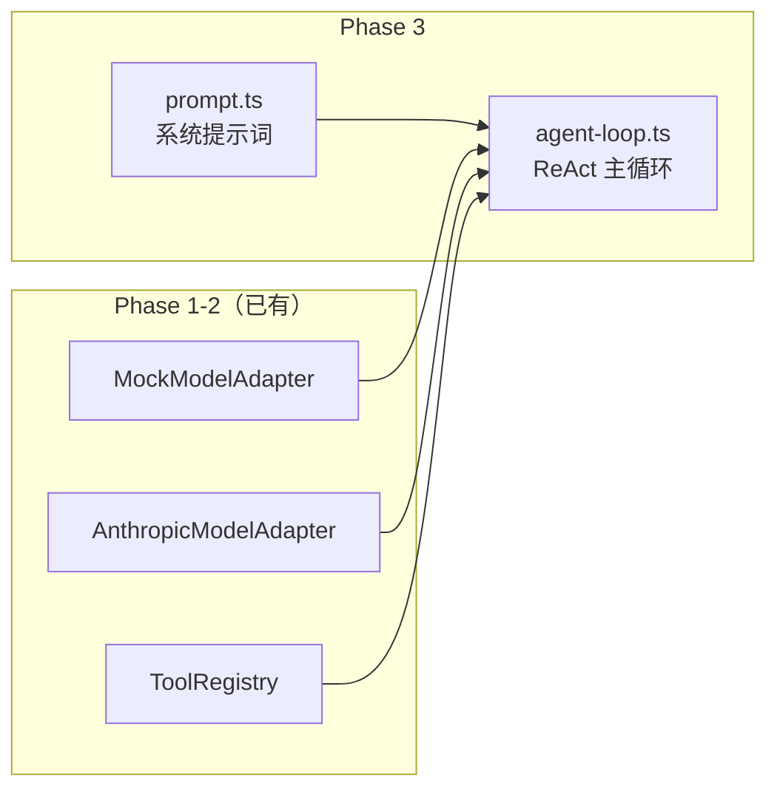
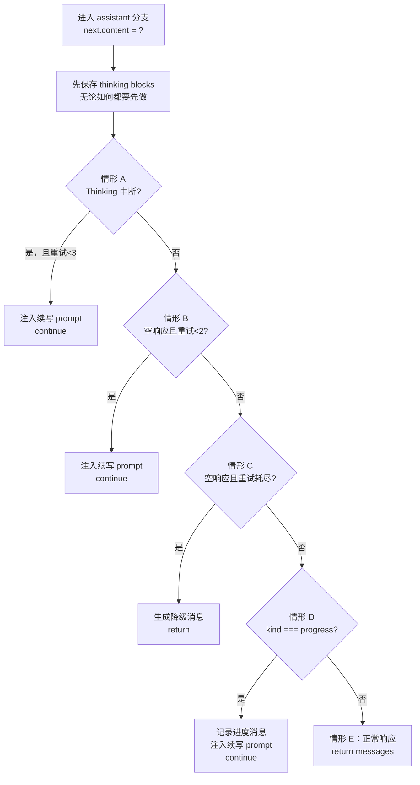
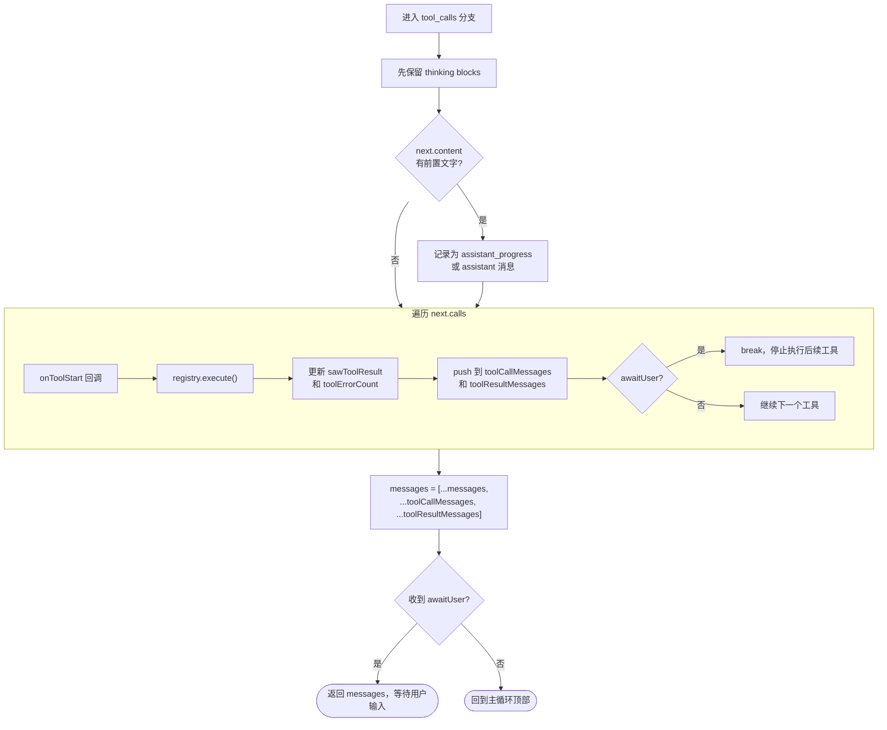
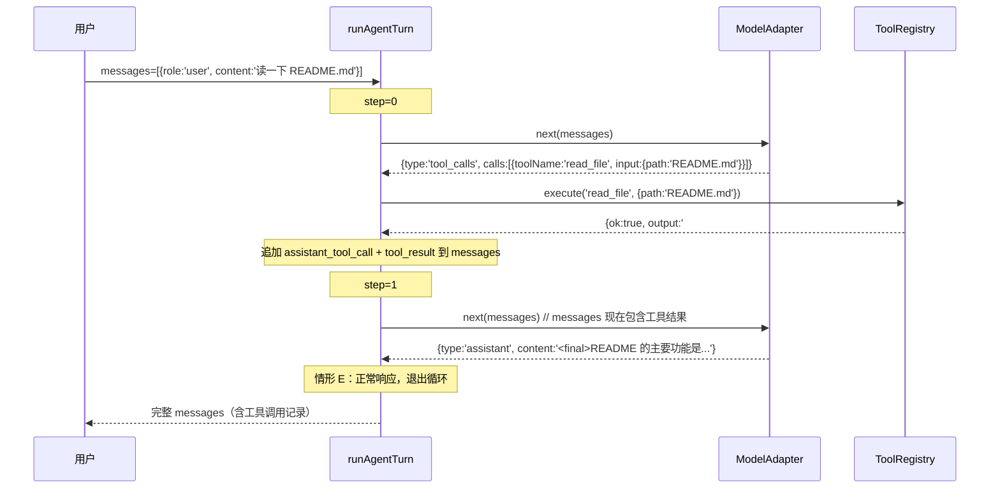

# Phase 3 代码导读：Agent Loop + System Prompt

> 本文档基于 Phase 3 已实现的代码，帮助你理解 ReAct 主循环的完整工作机制，以及每个设计决策背后的原因。

---

## 一、Phase 3 做了什么？

Phase 1-2 已经准备好了所有零件：类型系统、工具注册表、Anthropic 适配器。Phase 3 把这些零件**组装起来**，实现了真正的 Agent 行为：

```
Phase 1-2：零件工厂
  types.ts        ── 数据结构定义
  tool.ts         ── 工具注册与执行
  anthropic-adapter.ts ── 调用 LLM
  mock-model.ts   ── 离线测试用 LLM

Phase 3：把零件装进发动机
  agent-loop.ts   ── ReAct 主循环（核心）
  prompt.ts       ── 系统提示词构建
```

Phase 3 完成后，Agent 第一次能自主完成多步任务：

```
用户："帮我读一下 README.md 然后总结主要功能"
  → 模型推理：我需要读文件
  → 调用 read_file 工具
  → 拿到文件内容
  → 模型推理：现在可以总结了
  → 返回总结给用户
```

---

## 二、两个新文件

### 2.1 总览



**`prompt.ts`** 负责构建发给模型的"宪法"（系统提示词），告诉模型它是谁、应该怎么行动、怎么格式化响应。

**`agent-loop.ts`** 是整个 Agent 的心脏——`runAgentTurn()` 函数驱动模型反复推理和执行工具，直到任务完成。

---

## 三、`prompt.ts` — 模型行为的"宪法"

### 3.1 整体结构

```typescript
export async function buildSystemPrompt(cwd: string): Promise<string> {
  const parts = [
    '你是 mini-code，一个终端编程助手。',
    '默认行为：检查代码仓库、使用工具、...',
    `当前工作目录：${cwd}`,
    // ... 更多指令
    '结构化响应协议：',
    '- 当你仍在工作时，以 <progress> 开头。',
    '- 任务完成时，以 <final> 开头。',
  ]
  return parts.join('\n\n')
}
```

System Prompt 覆盖四类内容：

| 类型 | 示例 | 作用 |
|------|------|------|
| 角色定义 | "你是 mini-code，一个终端编程助手" | 确定模型身份，影响回答风格 |
| 工作目录 | `当前工作目录：${cwd}` | 工具操作的默认路径基准 |
| 行为偏好 | "优先动手而非给建议" | 防止模型只输出分析文字，不调用工具 |
| 响应协议 | `<progress>` / `<final>` 标签 | **Agent Loop 用来判断是否退出循环的信号** |

### 3.2 结构化响应协议是关键

`<progress>` 和 `<final>` 标签是 Agent Loop 和模型之间的**约定信号**：

```
模型输出 "<progress>正在分析代码..."
  → Loop 判断：还没完成，继续
  → 注入续写提示，让模型继续执行

模型输出 "<final>分析完成，共发现 3 个问题：..."
  → Loop 判断：任务完成，退出
  → 把内容返回给用户
```

没有这个协议，Loop 无法区分"模型正在思考中"和"模型已经给出答案"。

### 3.3 为什么 `cwd` 要动态注入？

不同用户在不同目录下运行，工具调用的相对路径基准不同。把 `cwd` 写进 System Prompt，模型在推理时就知道"工作目录是 `/Users/xx/project`"，生成工具调用参数时会以此为基准，不会出现路径错误。

> Phase 5 会扩展这里：注入权限摘要、可用工具列表、MCP 服务器信息、MEMORY 文件内容（K-40）。

---

## 四、`agent-loop.ts` — ReAct 主循环

### 4.1 函数签名全景

```typescript
export async function runAgentTurn(args: {
  model: ModelAdapter          // 调用 LLM 的接口（真实 or Mock）
  tools: ToolRegistry          // 工具注册表
  messages: ChatMessage[]      // 当前消息历史
  cwd: string                  // 工作目录
  maxSteps?: number            // 最大步数（默认 100）
  onToolStart?:    (toolName, input) => void        // 工具开始时回调
  onToolResult?:   (toolName, output, isError) => void // 工具结束时回调
  onAssistantMessage?: (content) => void            // 最终消息回调
  onProgressMessage?:  (content) => void            // 进度消息回调
}): Promise<ChatMessage[]>
// 返回：本回合结束时的完整消息历史
```

**返回值是完整消息历史**，不是单条回复。调用方把它作为下一回合的 `messages` 传入，实现跨回合的"记忆"。

### 4.2 主循环骨架

```mermaid
flowchart TD
    Start([runAgentTurn 被调用]) --> Init[初始化计数器]
    Init --> Loop

    subgraph Loop["for step in maxSteps"]
        Model["next = model.next(messages)\n调用模型，获取下一步决策"] --> Branch{next.type}
        Branch -- assistant --> A[assistant 分支\n处理5种情形]
        Branch -- tool_calls --> B[tool_calls 分支\n执行工具]
        B --> Append[追加工具消息到 messages]
        Append --> Loop
        A -- 正常响应 / 降级 --> Return([返回 messages])
    end

    Loop -- step >= maxSteps --> Fallback[降级：输出最大步数提示]
    Fallback --> Return
```

每次循环做一件事：调用模型，根据返回类型走不同分支。`tool_calls` 分支执行完继续循环；`assistant` 分支处理后退出。

### 4.3 状态变量的作用

循环开始前初始化 4 个计数器：

```typescript
let emptyResponseRetryCount = 0      // 空响应重试次数（上限 2）
let recoverableThinkingRetryCount = 0 // Thinking 中断重试次数（上限 3）
let toolErrorCount = 0               // 本回合工具报错总数（降级消息用）
let sawToolResultThisTurn = false    // 是否执行过工具（区分两类空响应）
```

这些变量贯穿整个回合，让 Loop 能根据"当前到底发生了什么"做出不同决策：

```
sawToolResultThisTurn = false → 纯空响应  → 提示"直接给出答案"
sawToolResultThisTurn = true  → 工具后空响应 → 提示"处理工具结果继续"
toolErrorCount > 0            → 工具有报错 → 在降级消息里告知错误数量
```

---

## 五、assistant 分支的 5 种情形

`next.type === 'assistant'` 时，Loop 不一定直接退出，需要先判断 5 种情形：



### 5.1 情形 A：Thinking 阶段中断

**触发条件**：模型在 thinking 阶段被 `pause_turn` 或 `max_tokens` 打断，文本内容为空。

```
模型返回：{ content: '', diagnostics: { stopReason: 'max_tokens', blockTypes: ['thinking'] } }
```

空文本是**正常的**——模型只输出了 thinking 块，还没来得及输出文字。此时注入续写提示，让模型接着想：

```
"你的上一条响应在思考阶段触发了 max_tokens。
 请立即继续执行下一个具体工具调用..."
```

最多重试 3 次（比普通空响应多一次，因为 Thinking 场景更容易中途中断）。

### 5.2 情形 B：普通空响应（可恢复）

**触发条件**：模型偶发返回空文本，没有 thinking 中断迹象。

注入续写提示，根据本回合是否已执行过工具选择不同措辞，最多重试 2 次：

```
有工具结果时："工具执行后你的上一条响应为空。请继续尝试下一个具体步骤..."
无工具结果时："你的上一条响应为空。请立即继续执行具体工具调用..."
```

**为什么不立即报错？** LLM 偶发性空输出很常见，一次 continuation prompt 通常就能恢复，强行中断会损害用户体验。

### 5.3 情形 C：空响应降级（重试耗尽）

**触发条件**：情形 A/B 重试次数都用完，还是空响应。

生成人类可读的诊断消息，以 `assistant` 身份追加后退出回合：

```
有工具错误时："工具执行后模型返回空响应，已停止。最近有 N 个工具报错..."
无工具错误时："工具执行后模型返回空响应，已停止。请重试..."
无工具结果时："模型返回空响应，已停止。请重试..."
```

`toolErrorCount` 在这里发挥作用——帮助用户判断是工具问题还是模型问题。

### 5.4 情形 D：Progress 响应

**触发条件**：`next.kind === 'progress'`（System Prompt 要求模型以 `<progress>` 开头时输出这个）。

模型表示"任务进行中，还没完成"。把进度文字记录为 `assistant_progress`（区别于最终的 `assistant`），然后注入续写提示推动下一步：

```typescript
messages = [...messages, { role: 'assistant_progress', content: next.content }]
pushContinuationPrompt('从你的 <progress> 更新处立即继续...')
continue  // 回到循环顶部
```

这里不调用 `onAssistantMessage`（那会把进度消息展示给用户），而是调用 `onProgressMessage`（UI 可以显示为加载指示）。

### 5.5 情形 E：正常最终响应

五种情形里最简单的一种——通知 UI，返回完整消息历史：

```typescript
args.onAssistantMessage?.(next.content)
return [...messages, { role: 'assistant', content: next.content }]
```

---

## 六、tool_calls 分支

当模型决定调用工具时，进入 `tool_calls` 分支，执行完继续循环。

### 6.1 执行流程



### 6.2 为什么用两个数组而不是边执行边追加？

这是个容易忽略的协议细节。Anthropic API 要求消息顺序必须是：

```
[所有 assistant_tool_call] → [所有 tool_result]
```

而不能交错：

```
❌ assistant_tool_call₁ → tool_result₁ → assistant_tool_call₂ → tool_result₂
✅ assistant_tool_call₁ → assistant_tool_call₂ → tool_result₁ → tool_result₂
```

所以分两个数组收集，最后一次性 `[...toolCallMessages, ...toolResultMessages]` 追加：

```typescript
const toolCallMessages: ChatMessage[] = []
const toolResultMessages: ChatMessage[] = []

for (const call of next.calls) {
  toolCallMessages.push({ role: 'assistant_tool_call', ... })
  toolResultMessages.push({ role: 'tool_result', ... })
}

messages = [...messages, ...toolCallMessages, ...toolResultMessages]
```

### 6.3 失败不中断原则

一个工具失败**不会**停止其他工具的执行，也不会抛出异常。错误以 `isError: true` 的 `tool_result` 反馈给模型：

```typescript
toolResultMessages.push({
  role: 'tool_result',
  content: result.output,  // 错误信息
  isError: !result.ok,     // true 时模型知道出错了
})
```

模型看到 `isError: true` 的结果后，可以自主决定：重试、换方案、还是告诉用户有问题。

### 6.4 awaitUser 信号

`ask_user` 这类工具需要暂停 Loop 等待用户输入。工具通过返回 `awaitUser: true` 发出信号：

```typescript
if (result.awaitUser) {
  awaitUserResult = { output: result.output }
  break  // 立即停止，不执行后续工具
}
```

Loop 收到信号后，把工具输出的问题文本以 `assistant` 身份展示给用户，然后返回。用户回答后，外部调用方把回答注入 messages，再次调用 `runAgentTurn` 继续任务。

---

## 七、Thinking Block 保留（K-14）

每次调用 `model.next()` 后，第一件事是保留 thinking blocks：

```typescript
// assistant 分支和 tool_calls 分支都有这一行，且都在最前面
messages = appendThinkingBlocks(messages, next.thinkingBlocks)
```

**为什么必须保留？** Anthropic API 的硬性要求：

```
第 N 轮请求包含 thinking block
  → 第 N+1 轮请求必须在 messages 里包含那个 thinking block
  → 否则 API 返回 400："previous response's thinking block is missing"
```

`appendThinkingBlocks` 把 thinking blocks 包装成 `assistant_thinking` 角色的消息追加进历史。`toAnthropicMessages()` 在 Phase 2 里已经知道如何把这个角色转成 API 格式。

---

## 八、Continuation Prompt 工程（K-13）

`pushContinuationPrompt` 是 Loop 驱动模型继续工作的核心机制：

```typescript
const pushContinuationPrompt = (content: string) => {
  messages = [...messages, { role: 'user', content }]
}
```

**必须用 `user` 角色**：模型视角里，`user` 是任务发起者。以 `user` 角色注入续写提示，模型会认为是"用户在催我继续"，从而执行任务而不是礼貌性地结束对话。

Loop 在三种场景下注入续写提示：

| 场景 | 提示内容要点 |
|------|------------|
| 空响应 | "你的上一条响应为空，立即继续执行..." |
| Progress 消息 | "从你的 \<progress\> 更新处继续..." |
| Thinking 中断 | "从 pause_turn / max_tokens 处恢复，继续任务..." |

措辞里刻意包含"立即"——防止模型回复一段纯文字分析，而是直接调用工具或给出最终答案。

---

## 九、完整数据流：两轮迭代示例



---

## 十、各知识点与代码位置速查

| 知识点 | 代码位置 | 核心设计 |
|--------|---------|---------|
| K-10 ReAct 主循环 | `runAgentTurn` for 循环 | `tool_calls` 继续，`assistant` 退出 |
| K-11 工具执行 | `tool_calls` 分支 | 两数组收集保证协议顺序；失败不中断 |
| K-12 韧性设计 | `assistant` 分支情形 A/B/C | 空响应 2 次重试；Thinking 中断 3 次重试 |
| K-13 Continuation Prompt | `pushContinuationPrompt` | `user` 角色注入续写提示 |
| K-14 Thinking Block 保留 | `appendThinkingBlocks` | 每次响应后立即追加，防 400 报错 |
| K-15 System Prompt | `buildSystemPrompt` | 动态注入 `cwd`；约定 `<progress>`/`<final>` 协议 |

---

## 十一、常见问题

**Q：`maxSteps` 默认 100 够用吗？**

对绝大多数任务够用。一次"读文件 → 修改 → 验证"通常在 10 步以内。设 100 是防止极端情况下的无限循环，而不是常规任务的期望步数。

**Q：为什么空响应重试 2 次，Thinking 中断重试 3 次？**

Thinking 场景更容易触发多次中断（模型可能在 thinking 阶段持续被打断），需要更多机会恢复；普通空响应如果两次续写都无效，通常是模型卡住了，继续重试意义不大。

**Q：`assistant_progress` 和 `assistant` 两种角色有什么区别？**

- `assistant_progress`：任务进行中的中间消息，不展示给用户，`onProgressMessage` 回调（用于 spinner/loading 状态）
- `assistant`：最终消息，展示给用户，`onAssistantMessage` 回调

`toAnthropicMessages()`（Phase 2 里）会把两者都转成 Anthropic API 的 `assistant` 角色，但区分内部语义很重要——UI 层可以据此决定展示策略。

**Q：`onToolStart` / `onToolResult` 这些回调有什么用？**

纯 UI 通知。Phase 4（CLI 入口）会在这里实现：

```
正在调用 read_file...  ← onToolStart
✓ read_file           ← onToolResult
正在调用 bash...       ← onToolStart
✗ bash (exit 1)       ← onToolResult (isError=true)
```

Loop 本身不依赖回调的返回值，只是"通知外界正在发生什么"，不影响逻辑流转。

**Q：为什么 `runAgentTurn` 返回完整消息历史而不是最后一条消息？**

因为外部调用方（Phase 4 的 REPL）需要把这段历史传给下一回合的 `runAgentTurn`。如果只返回最后一条，工具调用记录就丢失了——模型在下一回合看不到之前做了什么，无法继续对话上下文。
